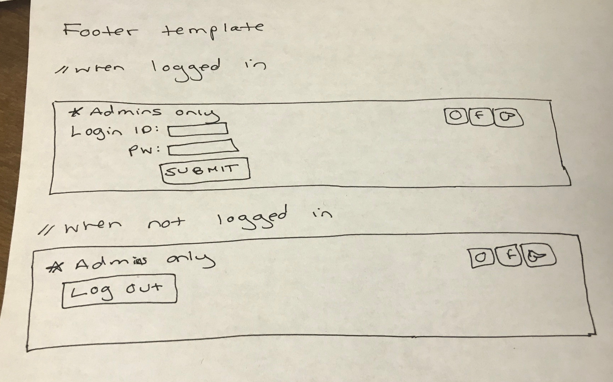

# Project 4: Design Journey

Your Team Name: White-Mammoth

**All images must be visible in Markdown Preview. No credit will be provided for images in your repository that are not properly linked in Markdown. Assume all file paths are case sensitive!**

## Client Description

Our client is a freelance artist named Jennifer Gibson.

## Meeting Notes

In-person meeting with client: 4/15/19

Purpose of Client's Website (Like a portfolio):

- To get work as a children's illustrator
  - Possible employers/recruiters are art directors mostly in NY or smaller-scale publishers who are in print publishing for children's illustrations.
- To showcase older pieces for purchase
  - By Local people
  - By Galleries
- Commissions
  - By Local people
  - By Galleries

- Clean, white background. Put focus on the art work.
- Likes idea of filtering gallery images. Would like to keep the categories she has on her squarespace site. For example, her illustrations category is specifically geared toward art directors for potential children's illustration work.
- Likes the form ideas
- Concerns: Image size and resolution. Would like good resolution for images and sizes that would be appropriate (i.e. so that user would not have to scroll to see the entire piece).
- We should give client ability to delete her images
- Client will send content/images, possibly login so we can access her squarespace site, and details about her pieces (title, date, description, such as what media she used).

- Theresa's question to the rest of the group: Should we give the client the option to edit the title/date/description of a single image? This is in case she adds an image where her description has a typo or something.

## Purpose & Content

Our client requested that we make her a new, improved website that could serve as a portfolio for her artwork, as well as a way to attract potential clients. This would mean that our website's content would include her art, details about her art (i.e. title, date, media, whether or not it is available for purchase), information regarding her previous projects, and forms to allow her to upload her new art and a contact/art request form.

## Target Audience(s)

Based on our meeting with the client, there are three main target audiences.

The first target audience is art directors interested in children's illustration work. Most of these art directors would live in NY. They would interact with the site to see her work and decide if they would like to publish it.

The second target audience is local people and galleries who may be interested in showcasing the client's older pieces for purchase. They would interact with the site similarly to the directors by viewing her portfolio and deciding if they would like to showcase her work.

The third target audience would be local people/galleries who want to buy art directly from the client. Rather than viewing the website for publishing or showcasing purposes, they would be deciding if they are interested in buying her work for themselves.

All of the target audiences would find the client's website through her referral to the site. They would interact with it on a personal or work computer to view the client's artwork and learn a bit about the artist. The client hopes to use the website as a portfolio.

## Client Requirements & Target Audiences' Needs

- Client requirement
  - **Requirement**
    - Client wants a clean, white background in order to not distract from her artwork
  - **Design Ideas & Choices**
    - We will adhere to the client's wishes by making the background white and creating a minimalist look.
  - **Rationale**
    - The client wants the focus to be on her art work. She doesn't want the target audience to be distracted by the design of the website and take away from its purpose.

- Client Requirement
  - **Requirement**
    - The client wants to make sure that each image is the appropriate size and resolution.
  - **Design Ideas and Choices**
    - We will design the website so that the user can view each image on their browser without having to scroll up/down to view the image.
  - **Rationale**
    - Make the images a good size (between 600px-900px as found from research on ideal dimensions for images on art websites) so that the target audience can consume them, but not too big that they are longer than the length of the website page. Minimize horizontal & vertical scrolling to further enhance the professional look of the website.

- Client Requirement
  - **Requirement**
    - The client wants to be able to edit images in her gallery (e.g. be able to delete an image, send an image, have titles/dates/descriptions of media)
  - **Design Ideas and Choices**
    - We will design the website so that when the client uploads an image she can add a title, date, and description of the media. In addition, after uploading she should be able to edit these pieces of information about the image.
  - **Rationale**
    - The client should be able to manage her artwork ongoing, so she should be able to edit her description of the image. Another example may be if a piece wins an award and she wants to mention that in the image description. Also, since the client is a freelancer, she needs to be able to showcase her works herself after we deliver the product to her. The client does not have a webmaster so the website should be accessible to her, especially when she wants to add works or modify details of her works.


Target Audience Needs for All Three Target Audiences
- Target Audience Need
  - **Need**
    - Client wants to filter gallery images the way they are currently filtered on her website. Filtering helps the target audience by making it easier to find the type of art they are looking for.
  - **Design Ideas and Choices**
    - We will include four albums for her 4 different styles that are carried over from her previous website - outdoor, portraits,  illustration, and personal.
    - We will create buttons for the albums to help filter the gallery.
  - **Rationale**
    - The target audiences will likely have a certain style in their mind when visiting the client's website, so we will make it simple for them to find the type of art they're looking for.
    - Since the target audience would be working professionals or local people/galleries, they may be older and not want to bother with complicated filtering. Therefore, having buttons that in essence do a filter search specific to the album categories will aid in simple usability.

- Target Audience Need
  - **Need**
    - Art Directors are busy filtering through different artists for children's illustrations. They will have to work through a high volume of applicants in a limited amount of time.
    - Local people or galleries that may want to showcase or purchase certain art pieces may already want a specific type of piece, and they may not have the time to go through the client's whole gallery of works.
  - **Design Ideas and Choices**
    - We will include an additional element to the search bar for the gallery so that the user can look up a keyword in the description field. For example, if a user entered "underwater" because they wanted to see her technique (maybe for art directors) or if they specifically wanted to showcase or purchase an underwater piece, any pieces that have the word "underwater" in the description will show up in the search results.
    - We will allow the user to flip through single image views of all search results (if a search was made) or all works (default).
  - **Rationale**
    - The text input field for a keyword search in addition to the tag search will further expedite the process of browsing for the busy target audiences. Since the purpose of the site is to engage the target audience's interest in the hopes of encouraging contact between the client and the target audience, adding this convenient way to filter the gallery would be helpful for busy users.
    - Flip through single image views: By having buttons on the left and right side of a single image view, a user can look through the single image views of search results or the whole gallery quickly without having to go back to the grid form and clicking on the next piece to see it in single image view.

Target Audience Need for Local People and Galleries
- Target Audience Need
  - **Need**
    - Want to purchase the client's art.
  - **Design Ideas and Choices**
    - We will include another filter button called "Available" that, when clicked, would show the pieces that the client would like to sell.
    - On the Gallery page, we will include a message that explains what the Available album is when the Available button is clicked..
    - On the single image view of a piece, we will indicate that the piece is Available if it is in the Available album
    - We will not list the price of the piece.
  - **Rationale**
    - The filter button creates a more personalized experience for target audience members who solely wish to purchase the client's work so that they do not have to unnecessarily browse through her art and guess whether or not a piece is on sale.
    - The message on the Gallery page guides the process of requesting to purchase a piece by directing the user to the contact/purchase form. By having the message right on the page where the gallery is, the user would see the instructions easily and know how to request an available piece.
    - By including the detail that the piece is Available in single image view, we would direct the user to the contact page so that they can request purchase. In case the user does not click on the Available album right away, this identification of availability on the single image view will inform the user who is interested in buying the piece.
    - We did not list the price of the piece in case the client would like to negotiate a price with a potential buyer.


## Initial Design

[Include exploratory idea sketches of your website.]


## Information Architecture, Content, and Navigation

[Lay out the plan for how you'll organize the site and which content will go where. Note any content (e.g., text, image) that you need to make/get from the client.]

[Document your process, we want to see how you came up with your content organization and website navigation.]

[Note: There is no specific amount to write here. You simply need enough content to do the job.]

- **Navigation**
  - Home
  - About
  - Gallery
    - View Single Image Fullscreen
  - Contact / Upload a File

- **Content** (List all the content corresponding to main navigation and sub-categories.)
  - *Home*
    - Short introduction
    - Single image of our clicnet's painting that can represent her art style
    - Short discription of the painting
  - *About*
    - Describe who Jennifer Gibson is
    - Past events
      - Exhibitions
      - Publications
      - Education
  - *Gallery*:
    - Four categories for her four different styles
      - outdoor
      - portraits
      - illustration
      - personal
    - When one category is clicked, paintings under the category will pop up
    - When one painting is clicked, full image of the painting and short discription will pop up
  - *Contact*:
    - Contact information
      - fb, instagram, email, phone number ... (Or should we put this in the footer?)
    - Form that asks users to input and submit their full name, email, phone number, and comments that will be sent to our client

- **Process**
  - [photo of card sort]
  

  - [explanation of how your come up with your content organization and navigation.]
    - We brainstormed together based on the information given from the first meeting with our client.

## Interactivity

- **Interactivity**
  - Users (login + logout)
  - Sessions
  - Gallery with user controls
    - Tags + Description
    - Viewing a single image in a larger format if you click it
      - Arrow buttons to cycle through images in gallery in larger format
      - Add tag forms
      - Remove tag forms
      - Delete image button
    - Searching by both tags and description
  - Art request form
    - Sticky
    - Feedback
  - Image Upload Form
    - Feedback

## Work Distribution

[Describe how each of your responsibilities will be distributed among your group members.]

[Set internal deadlines. Determine your internal dependencies. Whose task needs to be completed first in order for another person's task to be relevant? Be specific in your task descriptions so that everyone knows what needs to be done and can track the progress effectively. Consider how much time will be needed to review and integrate each other's work. Most of all, make sure that tasks are balanced across the team.]

- **Responsibilities For Each Member:**
  - Jinny: Home/About Page + Login/Logout/Sessions + Request Commission Form (sticky w/ feedback) + Nav bar + Design Sketcher
  - Shae: Gallery Page + Search Bar + Client Liason
  - Cora: Sticky form to upload image (sticky w/ feedback) + Initial CSS (general site layout) + Forms for editing details for single image on page (add/remove tags, delete image) + GenderMag evaluation facilitator
  - Theresa: Query String Parameter → viewing a single image on a page + functionality for arrow buttons to cycle through images on each single image page + Design Journey Editor

  Each person will add to the pseudocode planning section if need be or update the db schema for any relevant tables for their certain tasks.


- **Internal Deadlines (may change):**
  - By Tues 4/23: GenderMag Eval Completed, Design is Finalized
  - By Thurs 4/25 or Fri 4/26:
    1. Implement Home/About Page
    2. Initial CSS
    3. Login/Logout/Sessions
    4. Nav Bar
    5. Seed data for database in init.php

  - By Sat 4/28:
    6. Gallery Page

  - By Thurs 5/2 (doesn't have to be sticky forms yet; basic functionality and CSS)
    7. Search Bar, Upload image form, QSP single page
    8. Forms for editing details for single image
    9. Request commission form

  - By Sat 5/4:
    10. Functionality for arrow buttons

  - By DEADLINE 5/7:
    - All aspects fully functional. Style should be done. Forms sticky.
## Additional Comments

[If you feel like you haven't fully explained your design choices, or if you want to explain some other functions in your site (such as special design decisions that might not meet the final project requirements), you can use this space to justify your design choices or ask other questions about the project and process.]

All of the content (both images and text) we plan on using has been provided on her current website, <https://www.jgibsonillustration.com>. However, outside of some organizational structures, we will be completely redesigning her website from scratch.

Here are screenshots of the client's original website:


--- <!-- ^^^ Milestone 1; vvv Milestone 2 -->

- New sketches after receiving feedback from the Milestone 1


## Client Feedback

[Share the feedback notes you received from your client about your initial design.]
- Our client's only feedback was that she wanted "gallery" page before "about" page in the navigation bar.

## Iterated Design

[Improve your design based on the feedback you received from your client.]
- New sketches after receiving feedback from our client


## Evaluate your Design

[Use the GenderMag method to evaluate your wireframes.]

[Pick a persona that you believe will help you address the gender bias within your design.]

I've selected Abby as my persona.

I've selected my persona because Abby has the hardest time adapting to new technology. It is important that we don't assume the users of our client's website, or our client herself, are technologically adapted.

### Tasks

[You will need to evaluate at least 2 tasks (known as scenarios in the GenderMag literature). List your tasks here. These tasks are the same as the task you learned in INFO/CS 1300.]

[For each task, list the ideal set of actions that you would like your users to take when working towards the task.]

Task 1: Edit the title of an image in the gallery

  1. Log in
  2. Go to gallery page
  3. Delete current image
  4. Re-add the image to the gallery, changing it's title

Task 2: Contact the artist for purchasing inquiry

  1. Go to contact page
  2. Fill out form
  3. Submit form

### Cognitive Walkthrough

#### Task 1 - Cognitive Walkthrough

**Task name: Edit the title of an image in the gallery**

**Subgoal #1 : Log in**
  - Will Abby have formed this sub-goal as a step to their overall goal?
    - Yes, maybe or no: yes
    - Why?
      Abby will know that she has to log in to make changes to the gallery because it is a feature only people with authority have access to.

**Action #1A : Fill out username and password**
  - Will Abby know what to do at this step?
    - Yes, maybe or no: yes
    - Why? (Especially consider [persona name]'s Knowledge/Skills, Motivations/Strategies, Self-Efficacy and Tinkering.)
      Abby would have been given a username and password in order to login, so she will be able to complete this step.
  - If Abby does the right thing, will she know that she did the right thing, and is making progress towards her goal?
    - Yes, maybe or no: yes
    - Why? (Especially consider [persona name]'s Self-Efficacy and Attitude toward Risk.)
      Abby knows her login information and filling out a login form for a website is something she is already confident in because it is a functionality of many websites.

**Action #1B : Click submit**
  - Will Abby know what to do at this step?
    - Yes, maybe or no: yes
    - Why? (Especially consider [persona name]'s Knowledge/Skills, Motivations/Strategies, Self-Efficacy and Tinkering.)
    The submit button for the log in form is clear, so Abby will know she has to click it to complete her log in.
  - If Abby does the right thing, will she know that she did the right thing, and is making progress towards her goal?
    - Yes, maybe or no: maybe
    - Why? (Especially consider [persona name]'s Self-Efficacy and Attitude toward Risk.)
    There will no longer be a log in form in the footer once she is done logging in. To make this more clear, it might help to add a "log out" button in our sketches.

**Subgoal #2 : Go to the gallery page**
  - Will Abby have formed this sub-goal as a step to their overall goal?
    - Yes, maybe or no: yes
    - Why?
      Abby has low confidence, but one of her first actions will likely be to check the navigation bar to find out where she can complete her task. The gallery would be an instinctive choice to edit images.

**Action #2A : Click on gallery on navigation**
  - Will Abby know what to do at this step?
    - Yes, maybe or no: yes
    - Why? (Especially consider [persona name]'s Knowledge/Skills, Motivations/Strategies, Self-Efficacy and Tinkering.)
      Abby knows that she needs to edit an image that is in the gallery, so once she sees the navigation her choice would be to go to the gallery page
  - If Abby does the right thing, will she know that she did the right thing, and is making progress towards her goal?
    - Yes, maybe or no: yes
    - Why? (Especially consider [persona name]'s Self-Efficacy and Attitude toward Risk.)
      Abby will see the gallery page and know she is in the right place because it contains all of the images in the gallery and a place to edit the images.

**Subgoal #3 : Delete the current image**
  - Will Abby have formed this sub-goal as a step to their overall goal?
    - Yes, maybe or no: maybe
    - Why?
      Abby might hope there would be an edit button for images. Once she sees there isn't one, she might get nervous that she didn't find it. She may either give up or realize she can delete an image and then add it again in order to change the title.


**Action #3A : Select image**
  - Will Abby know what to do at this step?
    - Yes, maybe or no: no
    - Why? (Especially consider [persona name]'s Knowledge/Skills, Motivations/Strategies, Self-Efficacy and Tinkering.)
      Our sketches don't make it clear how to select an image.
  - If Abby does the right thing, will she know that she did the right thing, and is making progress towards her goal?
    - Yes, maybe or no: maybe
    - Why? (Especially consider [persona name]'s Self-Efficacy and Attitude toward Risk.)
      If Abby finds a way to select the image, she will know it is selected and proceed to delete it.

**Action #3B : Click delete image**
  - Will Abby know what to do at this step?
    - Yes, maybe or no: yes
    - Why? (Especially consider [persona name]'s Knowledge/Skills, Motivations/Strategies, Self-Efficacy and Tinkering.)
      There is a clear "delete painting" button which Abby will know to click in order to delete the image.
  - If Abby does the right thing, will she know that she did the right thing, and is making progress towards her goal?
    - Yes, maybe or no: yes
    - Why? (Especially consider [persona name]'s Self-Efficacy and Attitude toward Risk.)
      The image will be deleted from the gallery, so Abby will know it is gone.

**Subgoal #4 : Re-add the image to the gallery, changing it's title**
  - Will Abby have formed this sub-goal as a step to their overall goal?
    - Yes, maybe or no: maybe
    - Why?
      If Abby knew to delete the image in the previous subgoal, she will know to add a new image. If she didn't, she might already be lost.

**Action #4A : Click on add a new painting**
  - Will Abby know what to do at this step?
    - Yes, maybe or no: yes
    - Why? (Especially consider [persona name]'s Knowledge/Skills, Motivations/Strategies, Self-Efficacy and Tinkering.)
      The button for "add a new painting" is clear and Abby will know to click on it.
  - If Abby does the right thing, will she know that she did the right thing, and is making progress towards her goal?
    - Yes, maybe or no: yes
    - Why? (Especially consider [persona name]'s Self-Efficacy and Attitude toward Risk.)
      There will be a window to select the image Abby wants to add. She will then select the image.

**Action #4B : Enter a title and tag**
  - Will Abby know what to do at this step?
    - Yes, maybe or no: maybe
    - Why? (Especially consider [persona name]'s Knowledge/Skills, Motivations/Strategies, Self-Efficacy and Tinkering.)
      Abby will know she needs to add a title and tags to her image, and she will see the form next to the "add a new painting" button she just completed. She might get confused by the search bar above this part of the form.
  - If Abby does the right thing, will she know that she did the right thing, and is making progress towards her goal?
    - Yes, maybe or no: yes
    - Why? (Especially consider [persona name]'s Self-Efficacy and Attitude toward Risk.)
      She will be able to see that she entered a title and tags.


**Action #4B : Upload image**
  - Will Abby know what to do at this step?
    - Yes, maybe or no: no
    - Why? (Especially consider [persona name]'s Knowledge/Skills, Motivations/Strategies, Self-Efficacy and Tinkering.)
      There is no submit button currently in our sketch.
  - If Abby does the right thing, will she know that she did the right thing, and is making progress towards her goal?
    - Yes, maybe or no: no
    - Why? (Especially consider [persona name]'s Self-Efficacy and Attitude toward Risk.)
      It is impossible for her to complete this action without the submit button, so we need to add that.

#### Task 2 - Cognitive Walkthrough

**Task name: Contact the artist for purchasing inquiry**

**Subgoal #1 : Go to contact page**
  - Will Abby have formed this sub-goal as a step to their overall goal?
    - Yes, maybe or no: maybe
    - Why?
      Abby knows she has to contact the artist in order to purchase her artwork, so it would be natural for her to go to the contact page. She may first check out the about page to see if there is any information about purchasing there. We may want to add some info there.

**Action #1A : Click on contact page**
  - Will Abby know what to do at this step?
    - Yes, maybe or no: maybe
    - Why? (Especially consider [persona name]'s Knowledge/Skills, Motivations/Strategies, Self-Efficacy and Tinkering.)
      As stated, she may be conflicted between the about and contact page.
  - If Abby does the right thing, will she know that she did the right thing, and is making progress towards her goal?
    - Yes, maybe or no: yes
    - Why? (Especially consider [persona name]'s Self-Efficacy and Attitude toward Risk.)
      She will see the form for contacting the artist and know she is in the right place.

**Subgoal #2 : Fill out form**
  - Will Abby have formed this sub-goal as a step to their overall goal?
    - Yes, maybe or no: yes
    - Why?
      Once Abby gets to the contact page, she will see the form and know to complete it in order to let the artist know she wants to purchase something.

**Action #2A : Choose a reason from dropdown**
  - Will Abby know what to do at this step?
    - Yes, maybe or no: yes
    - Why? (Especially consider [persona name]'s Knowledge/Skills, Motivations/Strategies, Self-Efficacy and Tinkering.)
      Her options will be for purchase or general inquiry. She wants to buy artwork, so she will select purchase.
  - If Abby does the right thing, will she know that she did the right thing, and is making progress towards her goal?
    - Yes, maybe or no: yes
    - Why? (Especially consider [persona name]'s Self-Efficacy and Attitude toward Risk.)
      She will see that she selected "purchasing" from the dropdown.

**Action #2B : Fill out rest of form**
  - Will Abby know what to do at this step?
    - Yes, maybe or no: yes
    - Why? (Especially consider [persona name]'s Knowledge/Skills, Motivations/Strategies, Self-Efficacy and Tinkering.)
      Abby is used to completing tasks, and this form is a simple task. She will know how to fill it out.
  - If Abby does the right thing, will she know that she did the right thing, and is making progress towards her goal?
    - Yes, maybe or no: yes
    - Why? (Especially consider [persona name]'s Self-Efficacy and Attitude toward Risk.)
      She will see her progress and what she has typed into the form.

**Subgoal #3 : Submit form**
  - Will Abby have formed this sub-goal as a step to their overall goal?
    - Yes, maybe or no: no
    - Why?
      There is no submit button on our sketches currently

**Action #2B : Click submit button**
  - Will Abby know what to do at this step?
    - Yes, maybe or no: no
    - Why? (Especially consider [persona name]'s Knowledge/Skills, Motivations/Strategies, Self-Efficacy and Tinkering.)
      There currently isn't a submit button for the form.
  - If Abby does the right thing, will she know that she did the right thing, and is making progress towards her goal?
    - Yes, maybe or no: maybe
    - Why? (Especially consider [persona name]'s Self-Efficacy and Attitude toward Risk.)
      If there is confirmation after submitting the form, Abby will know what she did is right.

### Cognitive Walk-though Results

[Did you discover any issues with your design? What were they? How will you change your design to address the gender-inclusiveness bugs you discovered?]

There were a few functionality issues with our design.

First, we realized that we need to include a log out button when the user is logged it. This will confirm for the user that they are logged in.

Next, it was confusing for the persona that the images didn't seem to have a select button in order to delete the image. We will implement that as well so that the user can easily see they need to select the image in order to delete it.

We also realized that the search bar next to the form for adding the image is confusing. It would make more sense for the search bar to be its own entity and not connected/so close to the form.

There were also issues with sketching the submit button for our forms. Submitting is a crucial part of implementing forms, so we need to fix our sketches.

We also realized that a persona like Abby may be confused as to where she should go to make a purchase from the artist. To make this more clear, we will add information in the about page that says users should go to "contact" page and fill it out if they wish to purchase artwork.

Finally, we need to make sure that users have confirmation of submitting the contact form. User feedback for submitting forms is imperative.

[Your responses here should be **very** thorough and thoughtful.]


## Final Design

[Include sketches of your finalized design.]

[What changes did you make to your final design based on the results on your cognitive walkthrough?]


Changes to about page: add section clarifying how target audience can go about buying artwork/inquiring with the artist


Changes to gallery 1 - when logged in: changed location of search bar, added submit button


Changes to contact page: added submit button

Changes to footer - created template, shows users login if they aren't logged in and shows log out so that user can log out (this also verifies for the user that they are currently logged in).


## Database Schema

[Describe the structure of your database. You may use words or a picture. A bulleted list is probably the simplest way to do this.]

```
user (
id : INTEGER {PK, U, Not, AI}
name : TEXT {Not}
admin_id : TEXT {Not} UNIQUE
password : TEXT {Not}
)

sessions (
id : INTEGER {PK, U, Not, AI}
user_id : INTEGER {}
session : TEXT {U, Not}
)

images (
id : INTEGER {PK, U, Not, AI}
filename : TEXT {Not}
ext : TEXT {Not}
description : TEXT
admin_id : INTEGER {Not}
)

tags (
id : INTEGER {PK, U, Not, AI}
tag : TEXT {Not}
)

image_tags (
id : INTEGER {PK, U, Not, AI}
tag_id : TEXT {Not}
image_id : TEXT {Not}
)

albums (
id : INTEGER {PK, U, Not, AI}
album : TEXT {Not}
)

image_albums (
id : INTEGER {PK, U, Not, AI}
album_id : TEXT {Not}
image_id : TEXT {Not}
)
```


## Database Queries

- Display all images

  - SELECT * FROM images;

- Search by tag

  - SELECT * FROM images INNER JOIN image_tags ON images.id = image_tags.image_id WHERE image_tags.tag_id = '%'||:tag_id||'%';

- Search by description

  - SELECT * FROM images WHERE image.description = '%'||:search||'%';

- Insert image

  - INSERT INTO images (filename, ext, description, user_id) VALUES (:filename, :ext, :description, :user_id)

- Remove image and its tags

  - DELETE FROM image_tags WHERE image_tags.image_id = ".$image_id

  - DELETE FROM images WHERE images.id = ".$image_id

- Insert tag

  - If the tag does not exist yet:

    - INSERT INTO tags (tag) VALUES (:tag)

  - Check for duplicate tag:

    - SELECT image_tags.image_id FROM image_tags WHERE image_tags.tag_id = ".get_tag_id($user_tag)

    - INSERT INTO image_tags (tag_id, image_id) VALUES (:tag_id, :image_id)

- Remove tag

  - DELETE FROM image_tags WHERE image_tags.image_id = ".$image_id." AND image_tags.tag_id = ".$tag_id

  - If this is the last image tagged with this tag:

    - DELETE FROM tags WHERE tags.id = ".$tag_id

- Access images from a particular album
  - SELECT images.id, images.filename, images.ext, images.description FROM images INNER JOIN image_albums ON images.id = image_albums.image_id WHERE image_albums.album_id = :album_id

- Inserting image into db (Maybe make into a function)
  - INSERT INTO images (filename, ext, description, user_id) VALUES (:filename, :ext, :description, :user_id)
  - INSERT INTO tags (tags) VALUES (:tag)
  - INSRT INTO image_tags (tag_id, image_id) VALUES (:tag_id, :image_id)
  - INSERT INTO albums (album) VALUES (:album)
  - INSERT INTO image_albums (album_id, image_id) VALUES (:album_id, :image_id)

- Trying to see if a single_img is in the available album
  - SELECT * FROM albums INNER JOIN image_albums ON albums.id = image_albums.album_id INNER JOIN images ON images.id = image_albums.image_id WHERE albums.album = 'available' AND images.id = :single_img_id;


## PHP File Structure

[List the PHP files you will have. You will probably want to do this with a bulleted list.]

* index.php - home page.
* about.php - about page.
* gallery.php - gallery page.
* contact.php - contact form page.
* singleimage.php - page used to view a single image and its details, including edit image form.
* includes/init.php - functionalities that are useful for every web page, including login/logout/sessions.
* includes/header.php - a header for every web page.
* includes/footer.php - a footer for every web page.


## Pseudocode

[For each PHP file, plan out your pseudocode. You probably want a subheading for each file.]

### index.php

```
include init.php
<body>
include header.php

code for an artwork created by Jennifer Gibson

coded for short discription for the image and summary of website

include footer.php
</body>
```

### about.php

```
include init.php
<body>
include header.php

link to contact page

code for an artwork created by Jennifer Gibson

code brief introduction and history of Jennifer Gibson

include footer.php
</body>
```

### gallery.php

```
include init.php

submit upload code

search validation code

print image function

print album buttons function

print tags buttons function

valid album function

valid tag function

search code + album/ tag buttons code/ both code

include head.php

<body>

include header.php

print all buttons

print all images

if user is logged in:

  show the edit gallery section

include footer.php
</body>
```

### contact.php

```
include init.php
<body>
include header.php

include contact form (reason, name, email, phone number, comment)

include footer.php
</body>
```

### singleimage.php

```
include init.php

refer to image_list from previous query on gallery page (using sessions)

code to process query string parameter to dynamically display page contents

if logged_in:
  edit painting form (SQL query)

<body>
include header.php

back button of slideshow will be QSP with id of entry at the previous index of the current image in image_list

show details of id of image selected according to QSP

next button of slideshow will be QSP with id of entry at the following index of the current image in image_list

if logged_in:
  edit painting form

include footer.php
</body>
```

### includes/init.php

```
login/logout

sessions

user-defined functions
```

### includes/header.php

```
header HTML

nav bar HTML

code to dynamically indicate current page in nav bar
```

## Additional Comments

[Add any additional comments you have here.]


--- <!-- ^^^ Milestone 2; vvv Milestone 3 -->

## Issues & Challenges

[Tell us about any issues or challenges you faced while trying to complete milestone 3. Bullet points preferred.]
- gallery.php had a bug where the keyword search could not be properly used. We debugged as a team, and we were able to figure it out.

- We were deciding where the most appropriate places for the upload form and edit image forms were, and after referring to our sketches and some discussion, we ultimately decided to put the upload form at the bottom of the gallery.php and to put the edit image form, including the delete image option, at the bottom of the single image page, singleimage.php. We realized that it would look cleaner for the client to have edit image details for the specific single image that she is viewing.

- Slideshow: We tried to figure out a way to store the search results of the gallery page when creating the slideshow on the single image page (the user would flip through the single image view of the images in the search results). We used sessions to store the list of images in the search results from the gallery.php so that it could be used in singleimage.php. We will have to ensure that doing so does not interfere with the sessions started when our client does admin login/logout.

--- <!-- ^^^ Milestone 3; vvv FINAL SUBMISSION-->

## Final Notes to the Clients

[Include any other information that your client needs to know about your final website design. For example, what client wants or needs were unable to be realized in your final product? Why were you unable to meet those wants/needs?]

The website is not responsive. Within the time constraints, the team decided to prioritize the more advanced functionalities of the website so that the content would be easily filterable and browsable. If the client would like to pursue this objective, we would be happy to discuss this feature.


## Final Notes to the Graders

[1. Give us three specific strengths of your site that sets it apart from the previous website of the client (if applicable) and/or from other websites. Think of this as your chance to argue for the things you did really well.]

1. Highly filterable and easily browsable content
  - Highly filterable content: While the client's previous website's content was organized in four general categories (outdoor, portrait, illustration, and personal), it did not offer a more specialized filtering experience for the busy target audience members. Users would have to scroll through the four albums to see works that were created with different types of media. As requested by the client, our website maintains the four general albums from the previous website; however, its additional implementation of tags for the art's media and a keyword search allows busy users to look for the content they want to see almost exactly. For example, if a gallery is looking for water pieces, the gallery can either click on the Outdoor album button or do a keyword search for "water." Furthermore, if an art gallery director wants to measure the client's skill when using pencil, they can just click on the pencil tag button. Since a keyword search can be done within any collection of images based on album or based on tag, the filtering process is even more specialized.

  - Easy Browsing of Works: Our website makes the images themselves easy-to-browse with the use of our slideshow feature in the single image view. If a user were to click on an image in the search query (whether the query be a result of albums, tags, keyword searches, or just all images), the user would be directed to a single image view of the work. We removed the need to scroll and to navigate back to the gallery in order to click on the next image in the query of images by directing the user to the very part of the page that has the title, image, and details of the piece. Also, we created a slideshow feature so that the user can just click back and forth through the single image views to see all the images. The client's prior website did not have this functionality.

  - Streamlined images in single image view: The images in the client's previous website had different dimensions, which made the site seem less professional looking. The client asked for us to find appropriate dimensions for her images so that they would showcase the details of the art well but would not be so large that they would require scrolling. With some research, we found that art pieces whose longest side is between 600px and 900px on websites are most appropriate because the images are not so small that details cannot be seen but are also not so large that they can be printed out and reproduced impermissibly. Therefore, we made the height of the images 640px and set the width to be auto so that the images would be proportional.

  - Clear indication of image details: The client's previous website did not have any information about the images. It did not indicate whether or not they were up for purchase - which did not help the client's request to get possible buyers from her website. In our website's single image view, the user is able to see the title of the piece, a short description about it (which may be good for screenreaders), tags indicating the media the client used, and an indication of availability if up for purchase. The indication of availability links to the Contact form, so it further assists the user's decision to purchase a piece.

2. Convenient, Multipurposeful Contact Form: The client's old website did not have an official contact form; she merely listed her email on her About page. In order to cater to the three different target audiences (art directors, local galleries, and local people) who may want to either purchase, commission, or contact the client for a job opportunity, we created a contact form. As mentioned prior, we link the Contact page when appropriate, such as when indicating that a piece is Available for purchase, so that users know how to contact the client best for their specific need.

3. Easy-to-Manage Works with Admin Privileges (Uploading & Editing Images): Given that our client is a freelance artist and that she used squarespace to create her website, it was clear to us that our site had to give the client the autonomy of running her own website (without the need for a webmaster) going forward. Since our website has more advanced functionalities than her more static initial site, we gave her upload and edit image forms that would allow her to easily manage her online portfolio.

[2. Tell us about things that don't work, what you wanted to implement, or what you would do if you keep working with the client in the future. Give justifications.]

If we were to keep working with the client in the future, we would probably work on a responsive design. Given that the client's current website is responsive and that target audience members may use a wide variety of devices with different screen dimensions, it would further add to the professionalism and streamlined appearance of the website. We were unable to do so in the time span of the project because we had to prioritize our more advanced functionalities; however, time permitting, we would address this need.


[3. Tell us anything else you need us to know for when we're looking at the project.]

Difference between albums and tags: We have albums and tags as two separate entities on our website. The albums are the more general categories carried over mostly from the client's previous site: Outdoor, Portrait, Illustrations, Personal, and our additions Available and All. The tags are the more specific features of the pieces themselves (i.e. different keywords or media: pencil, watercolor, nature, children) that can be found across various albums.

We have optimized the usability of our forms by providing user feedback and making the forms sticky.
